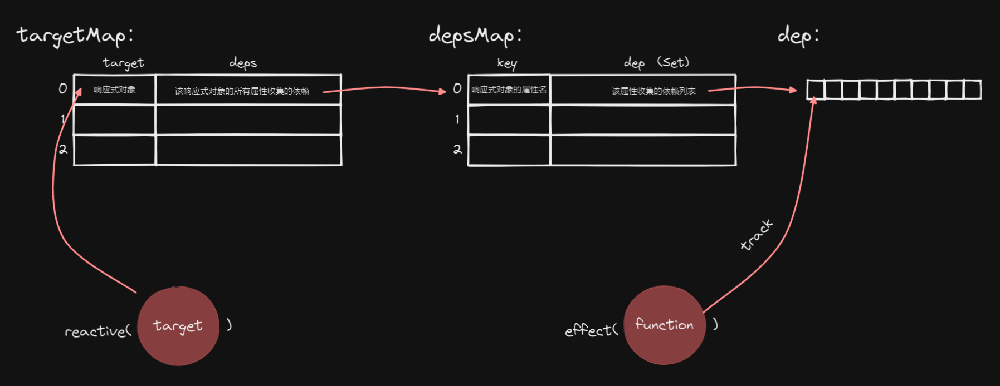

page-type:: [[api]]
tags:: Vue源码, api

- {{renderer :tocgen}}
- ## 响应式原理
	- 核心代码：
		- 代理响应式对象
		  ```typescript
		  // 代理响应式对象
		  
		  function createReactiveObject(target: Target, baseHandler: ProxyHandler<any>) {
		    const proxy = new Proxy(target, baseHandler);
		    return proxy;
		  }
		  
		  export function reactive(target: Target) {
		    return createReactiveObject(target, mutableHandlers);
		  }
		  ```
		- 收集依赖和触发依赖
		  ```typescript
		  function createGetter(isReadonly = false) {
		    return function get (target: Target, key: string, receiver: Object) {
		      const res = Reflect.get(target, key, receiver);
		      // getter 收集依赖
		      track(target, key);
		      return res;
		    }
		  }
		  const get = createGetter();
		  
		  function createSetter() {
		    return function set (target: Target, key: string, value:unknown, receiver: Object) {
		      const res = Reflect.set(target, key, value, receiver);
		      // setter 触发依赖
		      trigger(target);
		      return res;
		    }
		  }
		  const set = createSetter();
		  
		  export const mutableHandlers: ProxyHandler<object> =  {
		    get,
		    set,
		  }
		  ```
		- 收集和触发依赖具体流程
		  ```typescript
		  class ReactiveEffect<T = any> {
		    deps: Dep[] = []
		    constructor(public fn: () => T) {
		      return;
		    }
		    run() {
		      try {
		        activeEffect = this;
		        shouldTrack = true;
		      } catch (e) {
		        console.warn(e);
		      }
		      return this.fn();
		    }
		  }
		  
		  /**
		   * 将activeEffect作为依赖收集到全局变量`targetMap`中
		   */
		  export function track(target: object, key: unknown) {
		    if (shouldTrack && activeEffect) {
		      // 获取depsMap - 一个响应式对象对应最多一个depsMap
		      let depsMap = targetMap.get(target);
		      if(!depsMap) {
		        targetMap.set(target, (depsMap = new Map()));
		      }
		      // 获取dep - 响应式对象的每个key 对应最多一个 effect 数组(dep)
		      let dep = depsMap.get(key);
		      if(!dep) {
		        depsMap.set(key, ( dep = new Set([]) ));
		      }
		      trackEffect(dep);
		    }
		  }
		  
		  /**
		   * 将activeEffect作为依赖收集到特定的dep中
		   */
		  export function trackEffect(dep: Dep) {
		    dep.add(activeEffect);
		    activeEffect!.deps.push(dep);
		  }
		  
		  /**
		   * 触发target对应的依赖
		   */
		  export function trigger(target: Target) {
		    const depsMap = targetMap.get(target);
		    let deps: (Dep | undefined)[] = [];
		    if (depsMap) {
		      deps = [...depsMap.values()];
		    }
		    const effects: ReactiveEffect[] = [];
		    for (const dep of deps) {
		      if(dep) {
		        effects.push(...dep);
		      }
		    }
		    triggerEffects(effects);
		  }
		  
		  /**
		   * 触发Effect对应的所有依赖
		   */
		  export function triggerEffects(effects: ReactiveEffect[]) {
		    for (const effect of effects) {
		      effect.run?.();
		    }
		  }
		  ```
	- 数据结构：
		- 
-